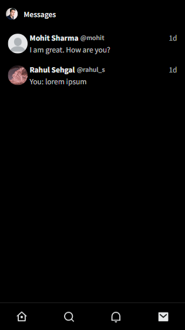

<h1 align="center">
  
  <br>
KooKoo - A Twitter Clone Application Built Using React, NodeJS, Express & PostgreSQL
</h1>

<p><font size="3">
  This is a Twitter clone built using <strong>React<em></em></strong> as the front end, <strong>NodeJS<em></em></strong> and <strong>Express<em></em></strong> as the back end, and <strong>PostgreSQL<em></em></strong> as the database.
  <br><br>
  In this app, users can create a new post (tweet), like posts, repost posts, follow other users, and chat with other users. Users can also see posts of other users they follow on their Home page and search for other users using the Search page. Users can sign in using either username and password or Google sign-in. It also has support for changing usernames, email, and passwords. Users can also upload an image to use as a profile picture. Users can also switch between dark, light, and dim themes and change accent color to their liking.
  <br><br>
  <strong><em>Take a look at the live version here:</em></strong> https://kookoo.up.railway.app/
</p>

## Table of Contents

- [Project Walk-Through](#project-walk-through)
  - [Sign-up Page](#sign-up-page)
  - [Sign-in Page](#sign-in-page)
  - [Home Page](#home-page)
  - [Search Page](#search-page)
  - [Post Detail Page](#post-detail-page)
  - [Messages Page](#messages-page)
  - [Notifications Page](#notifications-page)
  - [Profile Page](#profile-page)
  - [Settings Page](#settings-page)
    - [Account Information Page](#account-information-page)
    - [Change Username Page](#change-username-page)
    - [Change Email Page](#change-email-page)
    - [Change Date of Birth Page](#change-date-of-birth-page)
    - [Change Password Page](#change-password-page)
    - [Display Page](#display-page)
  - [Add Post Page](#add-post-page)
  - [Edit Profile Page](#edit-profile-page)
- [Responsive design](#responsive-design)
- [Live Demo](#live-demo)
- [Technologies Used](#technologies-used)
- [Development Workflow](#development-workflow)
- [Deploying To Heroku](#deploying-to-heroku)
- [Author](#author)
- [Helpful Resources](#helpful-resources)
- [License](#license)

# Project Walk-Through

# Sign-up Page


The Sign-up page consists of 3 buttons:

**_1) Google Sign-up button_**: Which, when clicked on, opens the Google Sign-in pop-up. Upon successful authentication with Google, the user is redirected back to the application, where they can continue the sign-up process.

**_2) "Sign up with phone or email" button_**: Which, when clicked on, opens the "Create Account" pop-up. Upon entering the name and email, the input fields are validated on the client side as well as on the server side. Clicking on the "Continue" button takes the user to the next page, where they can enter a password for their account. In the next step, the user is asked for their date of birth, which won't be made public. Finally, after entering the date of birth, the user is asked to choose their username and after successful validation, the user is redirected to the home page.


**_3) Sign-in button_**: It redirects the user to the sign-in page.

# Sign-in Page


The Sign-in page consists of 3 sections:

**_1) Google Sign-in button_**: Which, when clicked on, opens the Google Sign-in pop-up. Upon successful authentication with Google, the user is redirected back to the application, where they are either redirected to the home page or asked to continue the sign-up process if not already registered before.

**_2) Sign-in form_**: It includes inputs for username and password, and a sign-in button. Upon clicking the sign-in button, username and password fields are validated on the server side. The user is redirected to the home page after successful authentication, or an error is displayed if the authentication fails.

**_3) Sign-up button_**: It redirects the user to the sign-up page.

# Home Page


The Home page consists of 3 main sections:

**_1) Side Navigation Bar_**: It contains links to navigate to various pages, which are available only to authenticated users.

**_2) Compose Post Component_**: Users can create new posts (tweets) using this component. The post content is validated on the client side and as well as on the server side. If a post contains more than 255 characters, then a validation error is displayed.

**_3) Feed_**: Users can see posts and reposts by people they follow on their feed based on reverse chronological order. Users can also like, repost and comment on posts that appear in their feed.

# Search Page


The Search page consists of 2 sections:

**_1) Search Input_**: Users can search for other users using their name or username. If an At Sign `@` is used, then the search is performed using username.

**_2) Search Results_**: Search results are displayed and updated here as you type.

# Post Detail Page


The application navigates to the Post Detail page when a user clicks on a post that appears in their feed.

The Post Detail page consists of 3 main sections:

**_1) Post Component_**: This component displays the post that the user clicked on. Along with the post content, it also displays the date and time at which the post was created and also the number of likes, reposts, and replies the post received.

**_2) Post Reply Component_**: A user can reply to a post using this component. The content is validated on the client side and as well as the server side.

**_3) Post Replies Component_**: Users can see the replies made to their posts using this component.

# Messages Page


The Messages page consists of 2 sections:

**_1) Messages List Component_**: This component displays the list of users a user has received or sent messages to, along with the latest message sent or received and an unread message counter.

**_2) Chat Component_**: This component lets users chat with each other in real time. This component shows messages between two users, along with the date and time the message was sent or received.

# Notifications Page


The Notifications page consists of 1 sections:

**_1) Notification Component_**: This component shows the latest notifications. Users get notifications when someone follows them, replies to their post, likes or reposts their post.

# Profile Page


The Profile page consists of 3 sections:

**_1) The User Profile Component_** shows users' information like their name, username, bio and number of followers they have.

**_2) Edit Profile Button_**: This button lets a user change their profile information, like their name, bio, website URL, and profile picture.

**_3) User's Post List Component_** shows the user's posts in reverse chronological order. There are three tabs to navigate between the user's posts, replies, and the posts liked by the user.

# Settings Page


**_The Settings page_** includes settings for changing the username, password, and email and for changing the display settings such as the theme.

## Account Information Page


**_The Account Information Page_** contains information such as the user's username, email, date of birth, and the date at which the account was created.

## Change Username Page


The Change Username Page consists of 1 section:

**_Change Username Form_**: Users can change their username using this form. A user can change their username to a new one if it's not already taken by another user.

## Change Email Page


The Change Email Page consists of 1 section:

**_Change Email Form_**: Users can change their email using this form. A user can change their email to a new one if it's not already taken by another user.

## Change Date of Birth Page


The Change Date of Birth Page consists of 1 section:

**_Change Birth Date Form_**: Users can change their date of birth using this form. The validation is done on both the server and the client side.

## Change Password Page


The Change Password Page consists of 1 section:

**_Change Password Form_**: Users can change their password using this form. The validation is done on both the server and the client side.

## Display Page


Users can change the look and feel of the application using this page. It consists of 2 sections:

**_Accent Color Selector_**: This section allows users to select an accent color from the available options.

**_Background Color Selector_**: This section allows users to select a background color from the available options.

# Add Post Page


Users can add new posts by clicking on the **Add Post** button in the sidebar or by clicking on the **Floating Action Button** in the bottom right corner. The post content is validated on the client side and as well as on the server side. If a post contains more than 255 characters, then a validation error is displayed.

# Edit Profile Page


Users can update their profile details using the **_Edit Profile Form_**. This form allows users to update their profile picture, name, bio, and date of birth. The fields are validated on both the server and the client side.

# Responsive Design

This is web app is fully responsive to devices of all screen sizes. For example:

<p align="center">
  
   
  
</p>
<p align="center">
  
   
  
</p>
<p align="center">
  
   
  
</p>
<p align="center">
  
   
</p>
<p align="center">
  
   
</p>

# Live Demo

**_Take a look on the live version here:_** https://kookoo.up.railway.app/home **_or the recorded demo:_** https://www.youtube.com/watch?v=r3uxMZ5rudI

# Technologies Used

This project is built using:

- ReactJS
- React Hooks
- Custom React Hooks Like `useForm` and `useInView`
- React Query
- React Router V6
- Tailwind CSS
- NodeJS
- Express
- PostgreSQL
- Prisma
- Socket.IO
- Google Cloud Storage
- Multer
- Docker
- Docker Compose
- Heroku

# Development Workflow

### Prerequisites:

To be able to run this application locally on your system, you'll need:

- [Git](https://git-scm.com/downloads) version 2.25 or higher
- [Docker Desktop](https://docs.docker.com/desktop/install/windows-install/) version 4.6.0 or higher | OR | [Docker Engine](https://docs.docker.com/engine/install/ubuntu/) version 20.10.13 or higher AND Docker Compose version 1.29.2 or higher

### Steps to run this application locally:

1. Start by cloning the repository into your local file system.

   ```bash
   git clone https://github.com/SukhjinderArora/twitter-clone.git
   ```

2. CD in to the project directory

   ```bash
   cd twitter-clone
   ```

3. Open the repository in your favorite code editor.
4. Go into the `api` directory inside the project directory.
5. Rename the `.env.example` to `.env` and set up all the environment variables mentioned in that file.
6. Now go into the `client` directory inside the project directory.
7. Rename the `.env.example` to `.env` and set up all the environment variables mentioned in that file.
8. Finally run this command to start the application:

   ```bash
   docker-compose up -d postgres api client
   ```

9. Optionally, you can use `npx prisma db seed` to seed the database with dummy users. This command has to be executed from inside the running `api` container. To do so, run:

   ```bash
   docker exec -it twitter_clone_api /bin/bash
   ```

   **Note**: `twitter_clone_api` is the name of the `api` container in `docker-compose.yml` file.

   Once inside the container, run the following command from the terminal to seed the database:

   ```bash
   npx prisma db seed
   ```

10. Shut down the application by running:

    ```bash
    docker-compose down
    ```

# Deploying To Heroku

### Prerequisites:

To be able to deploy this app to Heroku, you'll need:

- An [Heroku](https://www.heroku.com/) account
- [Heroku CLI](https://devcenter.heroku.com/articles/heroku-cli) installed on your system

### Steps to deploy this app on Heroku:

1.  To provision the PostgreSQL database add-on from the `heroku.yml` file, you'll need to switch the Heroku CLI to the beta update channel. Then install the `heroku-manifest` plugin.

    ```bash
     heroku update beta
     heroku plugins:install @heroku-cli/plugin-manifest
    ```

    **Note:** You can switch back to the stable update stream and remove the plugin at any time:

    ```bash
       heroku update stable
       heroku plugins:remove manifest
    ```

    **Note:** You can provision the database manually from the Heroku dashboard if you do not want to switch to the beta channel.

2.  Now login to Heroku by running the following command:

    ```bash
    heroku login
    ```

3.  `CD` into the project's root directory and run:

    ```bash
    heroku create <application-name> --manifest
    ```

4.  After running this command, you'll get a remote URL of a new empty Git repository on Heroku. To set that empty git repository on Heroku as the remote on your local repository, run:

    ```bash
     git remote add heroku <remote-url>
    ```

5.  `CD` into the `client` directory of the project and run the following command to build the react application:

    ```bash
    cd client
    npm run build-and-move
    ```

    This command builds the React application and moves the `build` directory from the `client` directory to the `api` directory and renames it to the `public` directory.

6.  Now, `cd` into the project's root directory and run the following command to push the application to the remote Heroku repository:

    ```bash
    git subtree push --prefix api heroku main
    ```

    Because we only want to push the `api` directory to Heroku, this command will generate a new commit tree with the `api` directory as root, and push it to the remote Heroku repository.

7.  Check the logs to ensure that the application has been successfully deployed by running:

    ```bash
    heroku logs
    ```

8.  Set up the environment variables in your application dashboard on Heroku.

9.  You should now be able to access the application at `https://<application-name>.herokuapp.com/` in your browser.

# Author

**Sukhjinder Arora** 👨‍💻

- Github: https://github.com/sukhjinderArora
- LinkedIn: https://linkedin.com/in/sukhjinder-arora
- Website: https://sukhjinderarora.com
- Blog: https://medium.com/@sukhjinder
- Blog: https://whatisweb.dev

# Helpful Resources

- [Sign-in with Google](https://developers.google.com/identity/gsi/web/guides/overview)
- [Image upload with Google Cloud Storage and Node.JS](https://medium.com/@olamilekan001/image-upload-with-google-cloud-storage-and-node-js-a1cf9baa1876)
- [Deploying a Node.js and PostgreSQL Application to Heroku](https://www.newline.co/@kchan/deploying-a-nodejs-and-postgresql-application-to-heroku--0903a181)
- [Building Docker Images with heroku.yml](https://devcenter.heroku.com/articles/build-docker-images-heroku-yml)

# License

MIT License
